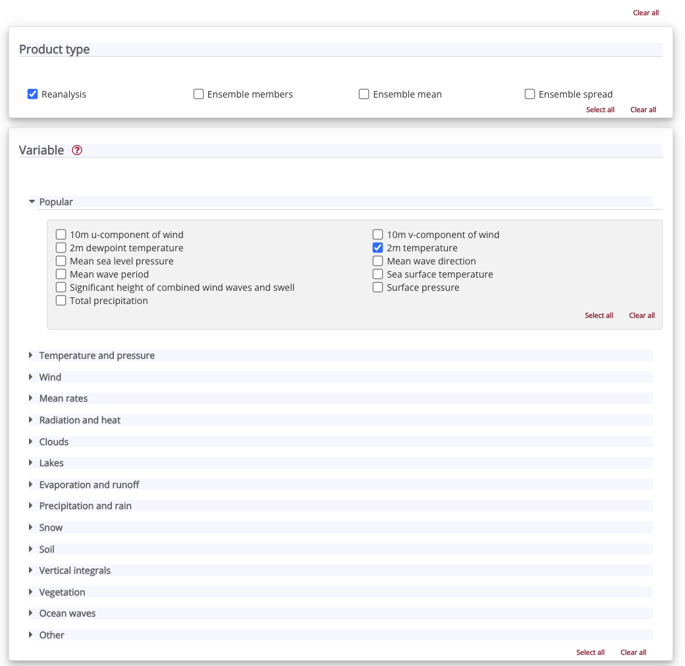
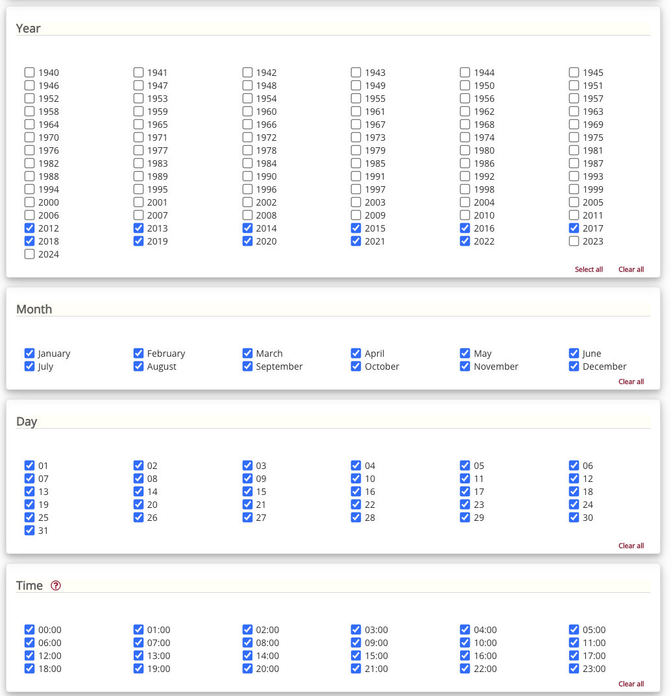
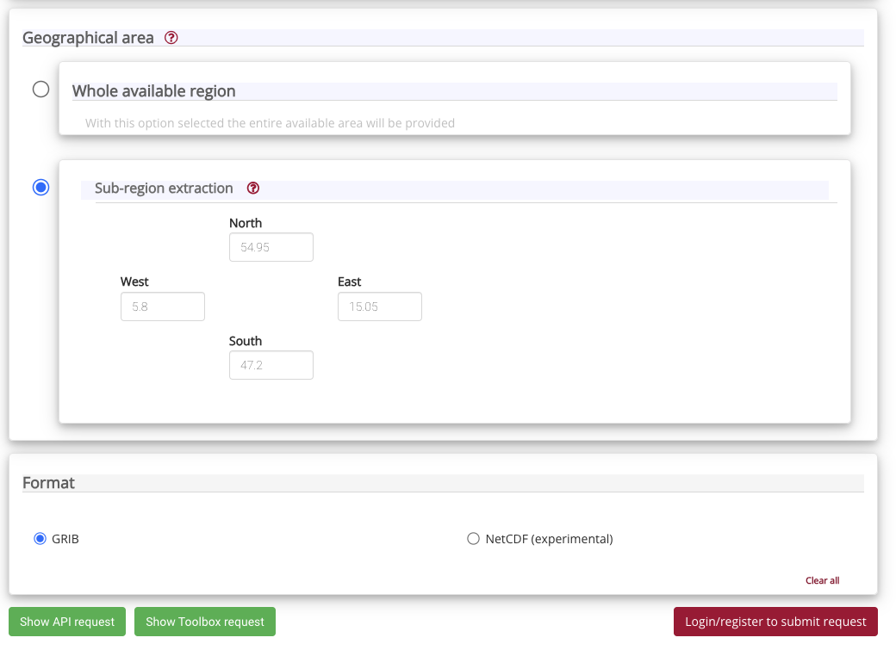

## Setup
All instructions are from the root of the repository, i.e. the folder containing this `README.md` file.

This code has only been tested on macos and linux. Equivalent commands may work on windows, but I cannot guarantee it.

### Pre-requisites

You will need to install conda as some of the packages are harder to install with pip.

### Create A virtual environment from the environment.yml file
```bash
conda env create -f environment.yml
```

### Activate the virtual environment
```bash
conda activate sim2real
```

### Install the sim2real package locally
This will allow you to import the `sim2real` package from anywhere on your system, and allows you to run files within the sim2real package via IPython or Jupyter.

```bash
pip install -e .
```

### Install the DWD data
Note, this downloads the **current** data from the DWD website, which has changed in the past. This might lead to unexpected downstream behaviour as the set of stations, dates, and the data itself changes. If you want to use the data from the paper, please contact the authors.

```bash
python sim2real/preprocessing/dwd.py
```

### Download the ERA5 data
This is not automated yet, but you can download the relevant data from the ERA5
website [here](https://cds.climate.copernicus.eu/cdsapp#!/dataset/reanalysis-era5-single-levels?tab=form).

The following screenshots show the settings you should use to download the data:




Alternatively, if you have the `cdsapi` package installed and configured, you can use the following python code to download the data:
<details>
<summary> Click to Expand </summary>

```python
import cdsapi

c = cdsapi.Client()

c.retrieve(
    'reanalysis-era5-single-levels',
    {
        'product_type': 'reanalysis',
        'variable': '2m_temperature',
        'year': [
            '2012', '2013', '2014',
            '2015', '2016', '2017',
            '2018', '2019', '2020',
            '2021', '2022',
        ],
        'month': [
            '01', '02', '03',
            '04', '05', '06',
            '07', '08', '09',
            '10', '11', '12',
        ],
        'day': [
            '01', '02', '03',
            '04', '05', '06',
            '07', '08', '09',
            '10', '11', '12',
            '13', '14', '15',
            '16', '17', '18',
            '19', '20', '21',
            '22', '23', '24',
            '25', '26', '27',
            '28', '29', '30',
            '31',
        ],
        'time': [
            '00:00', '01:00', '02:00',
            '03:00', '04:00', '05:00',
            '06:00', '07:00', '08:00',
            '09:00', '10:00', '11:00',
            '12:00', '13:00', '14:00',
            '15:00', '16:00', '17:00',
            '18:00', '19:00', '20:00',
            '21:00', '22:00', '23:00',
        ],
        'area': [
            54.95, 5.8, 47.2,
            15.05,
        ],
        'format': 'grib',
    },
    '1.grib')
```

This should download a file called `1.grib` to your current working directory.

</details>


You should then move the downloaded `1.grib` file to the path specified in `sim2real/config.py` under the `raw_era5` path. By default, this is the folder created by
```bash
mkdir -p data/raw/ERA_5_Germany
```
Then move `1.grib` to `data/raw/ERA_5_Germany/1.grib`, or adjust `raw_era5` in `sim2real/config.py` to point to the correct location.

Finally, process the file by running
```bash
python sim2real/preprocessing/era5.py
```

### Download the elevation data
This is also not automated yet. Please go to the [opendem SRTM data download](https://www.opendem.info/download_srtm.html) and download the SRTM "Digital Terrain Model of Germany".

This should download a file called `srtm_germany_dtm.zip`, which you should unzip into `srtm_germany_dtm.tif`. This tif file should be moved to the path specified in `sim2real/config.py` under the `raw_srtm` key. By default this is
```bash
mkdir -p data/raw/SRTM_DEM
```

Finally, process the file by running
```bash
python sim2real/preprocessing/srtm_dem.py
```
